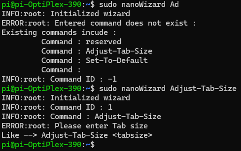

# nanoWizard
I dislike creating new settings for nano every time i brick a pi and install a new image. This should help with automatically setting up the basics and custom config
## install
run './install.sh' to install
## usage 
### nanoWizard [command] [arg1] [arg2] ....

