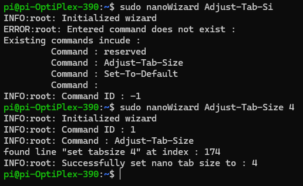

# nanoWizard
I hate making new settings for nano every time i brick a pi and install a new image. this should help with automatically setting up the basics.
## install
run './install.sh' to install
## usage 
### nanoWizard [command] [arg1] [arg2] ....

